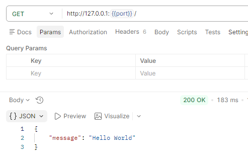
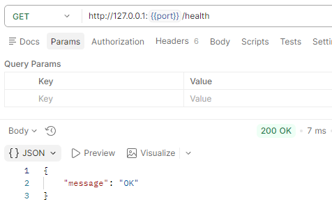
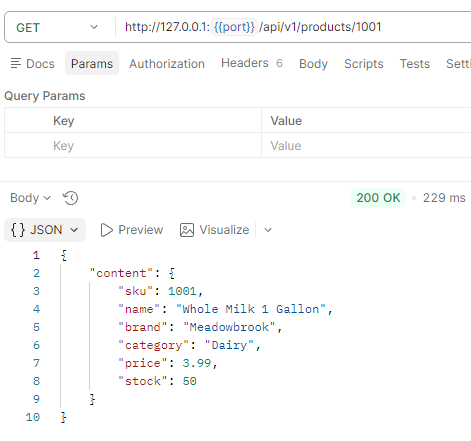
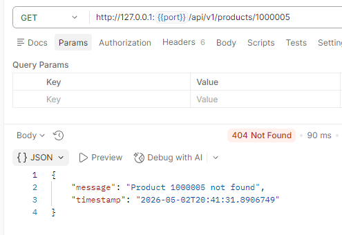
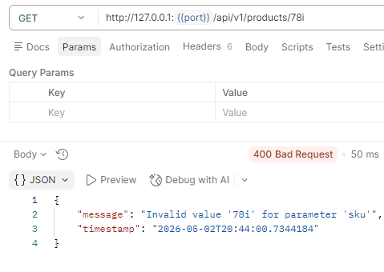
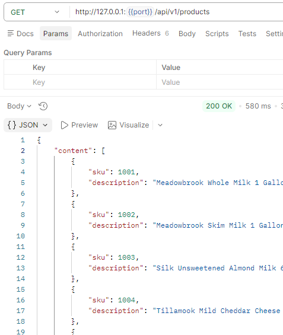
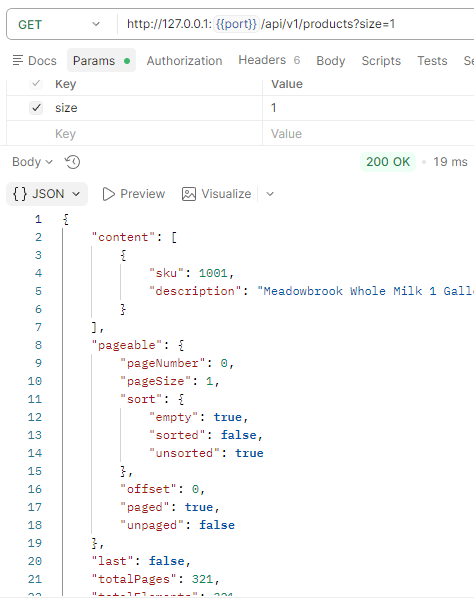
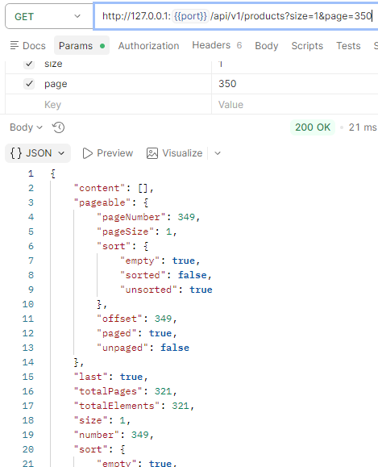
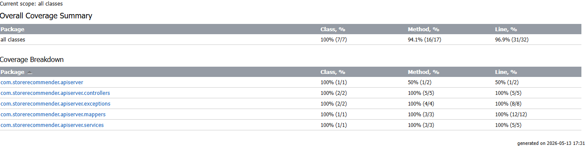

# API Server

## Overview

The **API Server** provides the **product catalog and lookup service** for the Store Recommender System.  It exposes a clean REST interface that the **agent** uses to:

* Load the entire store catalog on startup
* Look up product details by ID

This service acts as the system’s **data layer**, backed by a MySQL database.

---

## Features

The API Server is a Spring Boot application responsible for:

* Serving the full product catalog (`GET /api/v1/products`)
* Retrieving product details (`GET /api/v1/products/{sku}`)
* Backing data with a database using **MySQL**
* Providing strict separation between **data**, **agent logic**, and **UI**

---

## Architecture

The API server is the **data layer** of the system:

```bash
User
  ↓
Web App (uploads and recommendations UI)
  └── Agent (service layer inside web-app: parsing, fuzzy filtering, LLM calls)
        ↓
API Server (product catalog / inventory)
```

---

## Data Flow Summary

1. The agent starts and requests the entire store catalog from the API Server.
2. The web application forwards the user’s grocery list to the agent.
3. The agent parses the user’s grocery list.
4. For each parsed item, the agent fuzzy-filters the catalog to a relevant subset.
5. Based on this subset, the agent recommends products from the store.
6. For each product, the agent queries the API Server for details.
7. The agent produces a structured recommendation payload.
8. The web application renders this payload into a final confirmation page.

This clear separation ensures that **product data responsibilities remain isolated**, allowing the agent and UI to evolve independently.

---

## Tech Stack

* **Spring Boot** — REST API framework
* **Hibernate** — ORM
* **MySQL** — product datastore

---

## Endpoints

| Endpoint                 | Method | Description                            |
|--------------------------|--------|----------------------------------------|
| `/`                      | GET    | Homepage endpoint                      |
| `/health`                | GET    | Health check endpoint                  |
| `/api/v1/products`       | GET    | Returns a product listing              |
| `/api/v1/products/{sku}` | GET    | Returns details for a specific product |

---

## Database

The database is powered by **MySQL**.

### Note on Database Initialization Strategy

Schema creation and seeding are handled using **raw SQL** (`schema.sql` and `data.sql`), rather than Hibernate DDL generation or a migration tool like Flyway.

This design allows for a clean **separation of concerns**:

* **Database engineers or SQL specialists** can modify the schema and write seed data using the full power of SQL (indexes, constraints, triggers, bulk inserts, etc.).
* **Spring Boot developers** do not need to translate SQL logic into ORM code.
* The application consumes the resulting database through **JPA/Hibernate**, without being tied to how the database was initialized.

This mirrors production environments where schema creation and migrations are handled outside the application layer, making the system more flexible and easier to maintain.

---

## Screenshots

### Home Page

Displays the API Server's home page:



### Health Check

Displays a health check of the API Server:



### Product Details (Existing Product)

Displays details for a product that exists in the store inventory:



### Product Details (Non-Existing Product)

Displays an error for a product that does not exist, showing the HTTP 404 response:



### Product Details (Invalid SKU)

Displays an error for an invalid SKU, showing the HTTP 400 response:



### Product Listing (Default)

Displays the first 50 products when no query parameters are provided:



### Product Listing (1 Product per Page)

Since 321 products were seeded, setting 1 product per page creates 321 pages.

  

### Product Listing (1 Product per Page, Page 350)

Since only 321 products exist, requesting 1 per page results in an empty page for page 350:



---

## Testing

Unit tests for the API Server are located in:

```bash
api-server/src/test/java/com/storerecommender/apiserver
```

Integration tests are located in:

```bash
api-server/src/test/java/com/storerecommender/integration
```

Tests cover:

* Endpoint behavior
* Database initialization
* Product lookup logic

Total coverage is 96.9%:



---

## Notes

The API Server has no knowledge of the agent or the web application — it exposes product data and nothing more. This makes it independently testable and replaceable without affecting the rest of the system.

---
