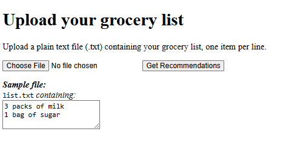
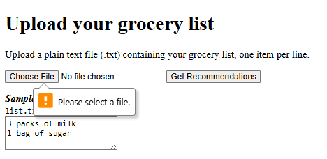
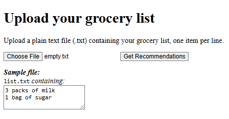
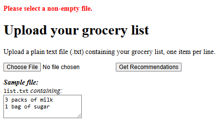
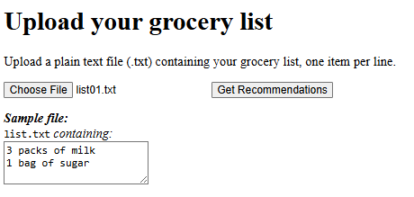
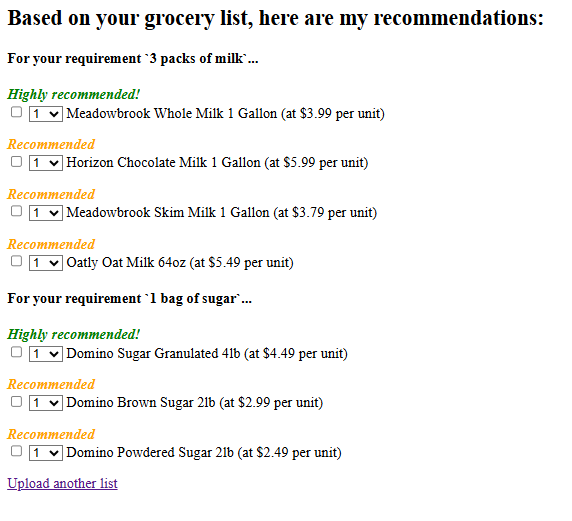
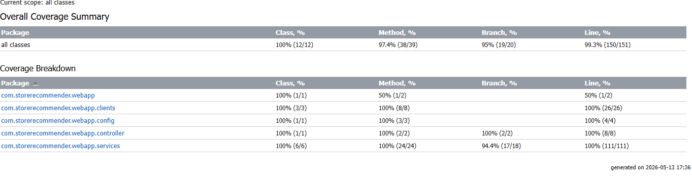

# Web App

## Overview

This component provides the **frontend interface** for the Store Recommender System.
It allows customers to upload grocery list files and displays the resulting product recommendations generated by the **agent**.

The **agent** is actually the backend of the web app.  It contains the business logic, and is discussed separately in `web-app/src/main/java/com/storerecommender/webapp/services/README.md`.  The **UI layer** is the focus in this README.

---

## Features

The **web app** is a Spring Boot application responsible for:

* Rendering the **Upload Page** (`/`)
* Validating and accepting uploaded grocery list files
* Forwarding file contents to the **agent**
* Receiving the agent’s consolidated recommendation payload
* Rendering the **Confirmation Page** displaying the recommendations

---

## Architecture

The web app is the **presentation layer** of the system:

```bash
User
  ↓
Web App (uploads and recommendations UI)
  └── Agent (service layer inside web-app: parsing, fuzzy filtering, LLM calls)
        ↓
API Server (product catalog / inventory)
```

---

## Data Flow Summary

1. User uploads a grocery list file.
2. Web app validates the file and sends the contents to the **agent**.
3. Agent processes the list (LLM + product knowledge + API server lookups).
4. Agent returns a structured recommendation payload.
5. Web app renders the final confirmation page to the user.

This clear separation ensures maintainability and allows the agent and API server to evolve independently of the UI.

---

## Tech Stack

* **Spring Boot** — web server and routing
* **Thymeleaf** — templating for pages
* **HTML/CSS/JavaScript** — simple UI

---

## Endpoints

| Endpoint       | Method | Description                                                              |
|----------------|--------|--------------------------------------------------------------------------|
| `/`            | GET    | Upload page for the grocery list file                                    |
| `/recommender` | POST   | Accepts uploaded grocery list file, calls agent, renders recommendations |

---

## Screenshots

### Homepage

Displays the file upload interface:


The user selects a grocery list file and submits it to the **agent** via the *Get Recommendations* button.

---

### No File Selected

If the user clicks *Get Recommendations* without selecting a file:


---

### Empty File Uploaded

Uploading an empty text file:


This triggers a validation error:


---

### Valid File Uploaded

When a valid grocery list file is uploaded:


The web app forwards the text to the **agent**, receives structured recommendations, and renders them:


---

## Testing

Unit tests for the web app are located in:

```bash
web-app/src/test/java/com/storerecommender/webapp
```

The tests cover:

* Page rendering
* File upload behavior
* Agent interaction using mocked responses
* Agent tests

Total coverage is 99.3%:



---

## Notes

The UI layer intentionally contains no domain logic — it validates the file and hands off to the agent. This keeps the controller easy to test in isolation, and means the presentation layer can be swapped out freely — React, Vue, Angular, or any other frontend — without touching the agent.

---
